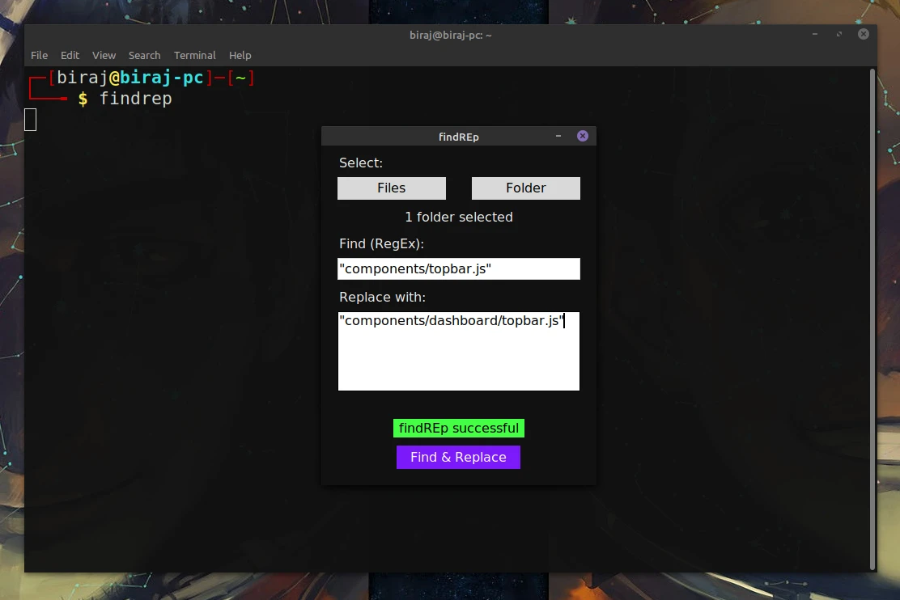

# FindREp
A simple tool to find and replace all the matches of a regular expression in file(s). You can either select the file(s) directly or select a folder. If you select a folder, it will also look for matches in files inside subfolders.



<br>

### General Instructions
* Make sure Python3 and Tkinter are installed.
* **src/main.py** is the entry point.
* If you select files, and if matches are found in them, their content will be changed and the original files will be stored in a folder called **original_files**.
* If you select a folder, original files will be stored in a folder called **<selected_folder_name>_original**, as its sibling.

### Linux Users (if you want the binary)
```
sudo apt install python3 python3-tk python3-pip
pip install pyinstaller
make release
```
Binary will be outputted inside _./dist_.
