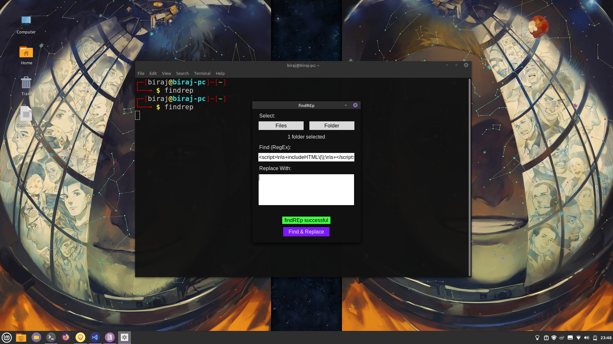

# FindREp
A simple tool to find all the matches of a regular expression in a directory (and even subdirectories!) or multiple files.



* Make sure Python3 and Tkinter is installed.
* __src/main.py__ is the entry point.

## For Linux Users
* Install [pyinstaller](https://pyinstaller.readthedocs.io/en/stable/)
* ```
  make release
  ```
* Binary will be outputted inside _./dist_.
